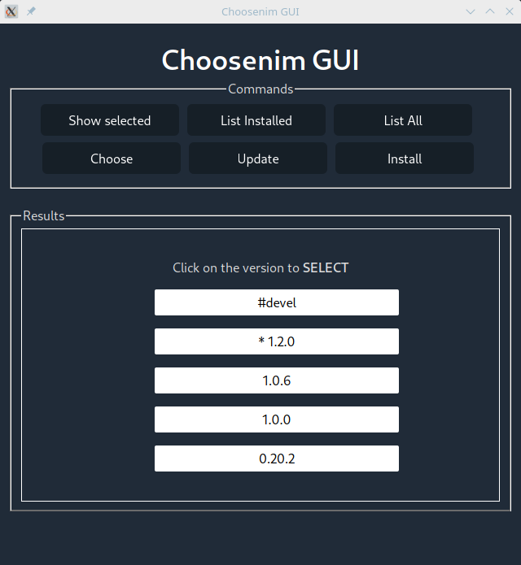

# GUI for choosenim

- A simple GUI for [choosenim](https://github.com/dom96/choosenim). Select, update and install the available versions of Nim.

Just run:
```nim
$ nimble install choosenimgui
$ choosenimgui
```

Powered by [Nim](http://nim-lang.org) and [WebGUI](https://juancarlospaco.github.io/webgui)

____

**Screenshots:**


